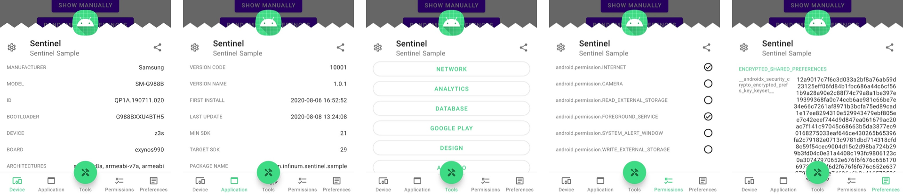

[  ](https://bintray.com/infinum/android/sentinel/_latestVersion)  

### 
# Sentinel



_Sentinel_ is a simple one screen UI that provides standardised entry point for tools used in development and QA alongside device, application and permissions data.  
It's designed to be easily configured and expanded depending on needs and requirements of developers and QA testers.  

The project is organized in the following modules:

- `sentinel` - contains a single screen UI that provides visual information about device, application, permissions and tools
- `sentinel-no-op` - contains stubs for easy release implementation of UI package and any Tools included
- `tool-chucker` - contains a class wrapper for Chucker
- `tool-collar` - contains a class wrapper for Collar
- `tool-dbinspector` - contains a class wrapper for DbInspector
- `tool-googleplay` - contains a class wrapper for Google Play
- `tool-thimble` - contains a class wrapper for Thimble
- `sample` - a sample app for testing and developing

## Usage

To include _Sentinel_ in your project, you have to add buildscript dependencies in your project level `build.gradle` or `build.gradle.kts`:

**Groovy**
```groovy
buildscript {
    repositories {
        jcenter()
        // or ...
        maven { url "https://dl.bintray.com/infinum/android" }
    }
}
```
**KotlinDSL**
```kotlin
buildscript {
    repositories {
        jcenter()
        // or ...
        maven(url = "https://dl.bintray.com/infinum/android")
    }
}
```

Then add the following dependencies in your app `build.gradle` or `build.gradle.kts` :

**Groovy**
```groovy
debugImplementation "com.infinum.sentinel:sentinel:1.0.5"
releaseImplementation "com.infinum.sentinel:sentinel-no-op:1.0.5"
```
**KotlinDSL**
```kotlin
debugImplementation("com.infinum.sentinel:sentinel:1.0.5")
releaseImplementation("com.infinum.sentinel:sentinel-no-op:1.0.5")
```

Basic tools are provided inside the main package but depending on requirements you might want to add specific tools:

**Groovy**
```groovy
debugImplementation "com.infinum.sentinel:tool-chucker:1.0.5"
debugImplementation "com.infinum.sentinel:tool-collar:1.0.5"
debugImplementation "com.infinum.sentinel:tool-dbinspector:1.0.5"
debugImplementation "com.infinum.sentinel:tool-googleplay:1.0.5"
debugImplementation "com.infinum.sentinel:tool-thimble:1.0.5"
```
**KotlinDSL**
```kotlin
debugImplementation("com.infinum.sentinel:tool-chucker:1.0.5")
debugImplementation("com.infinum.sentinel:tool-collar:1.0.5")
debugImplementation("com.infinum.sentinel:tool-dbinspector:1.0.5")
debugImplementation("com.infinum.sentinel:tool-googleplay:1.0.5")
debugImplementation("com.infinum.sentinel:tool-thimble:1.0.5")
```

Now you can sync your project.

### Getting started

Create or inject an instance of _Sentinel_ in your Application class and start watching for triggers:

```kotlin
    Sentinel.watch(
        setOf(
            ChuckerTool(),
            CollarTool(),
            DbInspectorTool(),
            GooglePlayTool(),
            ThimbleTool()
        )
    )
```

A set of tools should be provided as a _watch_ parameter. This set of tools can be empty.

### Tools

_Sentinel_ provides several different levels of tools for a developer to implement.

#### Built in

- `AppInfoTool` - opens Android OS Settings page of the application in which _Sentinel_ was implemented

#### Dependency wrappers

Depending of what you include as module dependencies, very specific tools are provided.
- `ChuckerTool` - a wrapper class that opens [Chucker](https://github.com/ChuckerTeam/chucker)
- `CollarTool` - a wrapper class that opens [Collar](https://github.com/infinum/android-collar)
- `DbInspectorTool` - a wrapper class that opens [DbInspector](https://github.com/infinum/android_dbinspector)
- `ThimbleTool` - a wrapper class that opens [Thimble](https://github.com/infinum/android-thimble)
- `GooglePlayTool` - a wrapper class that opens a Google Play if the application is published

#### Source abstractions

If you want to implement a different tool other than already packaged with a predefined type and name, several are available.
- `NetworkTool` - a wrapper interface with a name *Network* for any network interceptors
- `MemoryTool` - a wrapper interface with a name *Memory* for any memory management tools
- `AnalyticsTool` - a wrapper interface with a name *Analytics* for any analytics collectors
- `DatabaseTool` - a wrapper interface with a name *Database* for any database viewers
- `ReportTool` - a wrapper interface with a name *Report* for any crash reporting tools
- `BluetoothTool` - a wrapper interface with a name *Bluetooth* for any Bluetooth loggers
- `DistributionTool` - a wrapper interface with a name *Google Play* for any logic opening Play
- `DesignTool` - a wrapper interface with a name *Design* for any design utilities

#### Independent implementations

An interface is provided named _Sentinel.Tool_ that requires implementation of a *String resource* for a name and a _View.OnClickListener_.
An optional icon *Drawable resource* can be supplied.
Implementing this interface enables any class to be provided as a tool in _Sentinel_.
```kotlin
    interface Tool {

        @DrawableRes
        fun icon(): Int? = null

        @StringRes
        fun name(): Int

        fun listener(): View.OnClickListener
    }
```

### Triggers

_Sentinel_ observes several different trigger events, determining when to show up.
*Manual* and *Shake* triggers cannot be turned off but rest are configurable through _Sentinel_ settings except *Foreground* trigger when running on emulators.
Trigger states will be persisted between sessions.
*Upon first run, all triggers are enabled.*
- `Manual` - used for manually triggering UI with _show()_
- `Shake` - default trigger to show UI, shake device to invoke
- `Foreground` - shows UI every time application goes into foreground
- `USB connected` - shows UI every time an USB cable is plugged in
- `Airplane mode on` - shows UI every time Airplane mode is turned on

### Formatters

Data gathered and presented by _Sentinel_ can be shared to any text compliant recipient applications.
_Sentinel_ provides a few simple text formatters for easy integrations into other systems.
_Plain_ formatter is selected by default, but selecting any other is persisted between sessions.
- `Plain`
- `Markdown`
- `JSON`
- `XML`
- `HTML`

## Requirements

This plugin has been written in Kotlin but works both inside Kotlin and Java projects.
Minimum required API level to use _Sentinel_ is *21* known as [Android 5.0, Lollipop](https://www.android.com/versions/lollipop-5-0/).
_Sentinel_ is built with and for AndroidX projects.

## Contributing

Feedback and code contributions are very much welcome. Just make a pull request with a short description of your changes. By making contributions to this project you give permission for your code to be used under the same [license](LICENSE).
For easier developing a `sample` application with proper implementations is provided.
It is also recommended to change `build.debug` property in `build.properties` to toggle dependency substitution in project level `build.gradle`.
If you wish to add a new specific dependency wrapper tool, create a new module and set it up like the ones already provided.
Then create a pull request.

## License

```
Copyright 2020 Infinum

Licensed under the Apache License, Version 2.0 (the "License");
you may not use this file except in compliance with the License.
You may obtain a copy of the License at

   http://www.apache.org/licenses/LICENSE-2.0

Unless required by applicable law or agreed to in writing, software
distributed under the License is distributed on an "AS IS" BASIS,
WITHOUT WARRANTIES OR CONDITIONS OF ANY KIND, either express or implied.
See the License for the specific language governing permissions and
limitations under the License.
```

## Credits

Maintained and sponsored by [Infinum](http://www.infinum.com).

<a href='https://infinum.com'>
  
</a>
